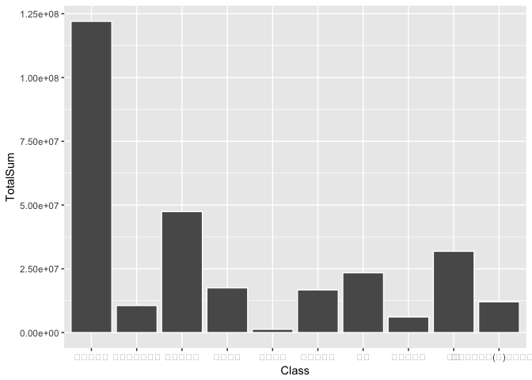

我要出去玩！！ - 全台灣走透透
================

組員： B0344128劉旻妮 B0344133陳宛俞

分析議題背景
------------

台灣人對於休閒娛樂觀光旅遊越來越重視，假日走訪各個觀光景點成為常見的現象。

分析動機
--------

美好的春天，當然要出門走春一下摟，好不容易能夠從平飼的壓力中解放的假日，台灣人都去哪了呢？

使用資料
--------

中華民國交通部觀光局 - 2016年國內主要觀光遊憩據點遊客人數月別統計

載入使用資料們 \#\#\#\#\#不能再按執行\#\#\#\#\#

``` r
library(readxl)
test <- read_excel("~/Desktop/9fb5c928-2bfb-4215-bc18-f63dc7c0b93.xls")
#幫欄位命名
names(test) <- c("Class", "Scenic Spots", "Location","Jan","Feb", "Mar", "Apr", "May", "Jun" , "Jul", "Aug", "Sep", "Oct", "Nov", "Dec", "Total")
#將第一欄刪除
test <- test[-1,]
```

資料處理與清洗
--------------

1.  將346到353的備註資料刪除
2.  將class填滿

-   1:98 國家風景區
-   99:143 國家公園
-   144:222 公營遊憩區
-   223:235 直轄市級及縣(市)級風景特定區
-   236:253 森林遊樂區
-   254:258 海水浴場
-   259:297 民營遊憩區
-   298:306 寺廟
-   307:325 古蹟、歷史建物
-   326:345 其他

1.  將原本的寬表轉成長表，並將value欄位轉換成數值

處理資料

``` r
#將346到353的備註資料刪除
test <- test[-c(346:353),]

#讀入class欄位表
library(readxl)
class <- read_excel("~/Desktop/class0.xls")
#將第一列（不完整的類型欄位）取代
test[,1] <- class$`類型 Class`

#寬轉長
library(reshape2)
test.m <- melt(test, id.vars = c("Class", "Scenic Spots", "Location"), na.rm = TRUE)
#欄位轉換成數值
test.m$value <- as.numeric(test.m$value)
```

探索式資料分析
--------------

圖文並茂圖文並茂

``` r
library(dplyr)
```

    ## 
    ## Attaching package: 'dplyr'

    ## The following objects are masked from 'package:stats':
    ## 
    ##     filter, lag

    ## The following objects are masked from 'package:base':
    ## 
    ##     intersect, setdiff, setequal, union

``` r
library(ggplot2)
library(stats)
library(base)

#比較2016年每一種類型的遊樂場所的總拜訪人數
test.total <- subset(test.m, grepl("Total", test.m$variable))
test.t <- test.total %>% group_by(Class, variable) %>%
  summarise(TotalSum = sum(value, na.rm = T)) %>%
  arrange(desc(TotalSum))
d<-sum(test.t$TotalSum)
test.t<-mutate(test.t,per=round(TotalSum/d*100,digits = 2))
#畫圖
ggplot()+geom_bar(data=test.t,
                  aes(x=Class,y=TotalSum),
                  stat = "identity",
                  colour="white")
```



``` r
#比較2016年每一種類型的遊樂場所的每月拜訪人數
test.all <- anti_join(test.m, test.total, by = "variable")   #把total值去掉
test.m.t <- test.all %>% group_by(Class, variable) %>%
  summarise(valuesum = sum(value, na.rm = T)) 
##畫圖
ggplot(test.m.t, aes(Class, variable)) + 
  geom_tile(aes(fill = valuesum),
            colour = "white")+ 
  scale_fill_gradient(
    low = "white",high = "steelblue")+
    theme_minimal()
```


期末專題分析規劃
----------------

期末專題要做2015與2016國內旅遊景點改變幅度與其他變化的交叉分析
